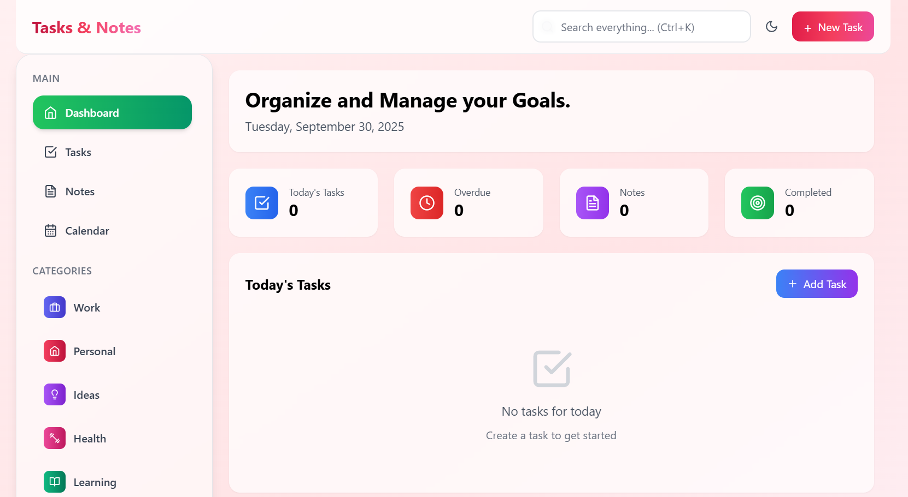
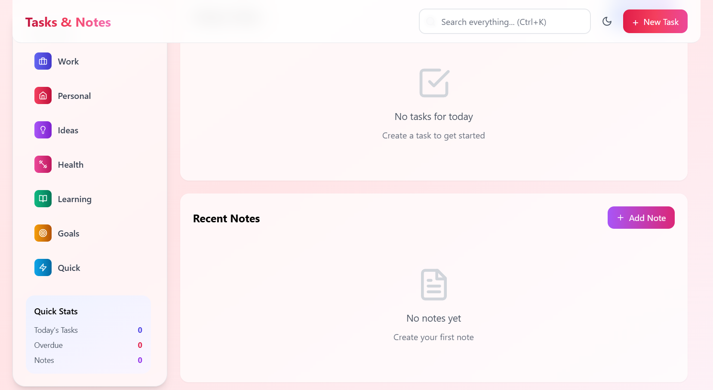

# Tasks & Notes - Modern Task & Note Management

A beautiful, feature-rich task management and note-taking application built with React and Tailwind CSS, featuring a sophisticated wine-themed design system.




## Features

### Task Management
- **Create & Organize Tasks** - Full CRUD operations with categories and priorities
- **Smart Filtering** - Filter by status, priority, due date, category, and starred items
- **Multiple Views** - Switch between grid and list layouts
- **Priority System** - High, Medium, and Low priority with visual indicators
- **Due Date Tracking** - Calendar integration with overdue alerts
- **Progress Tracking** - Visual progress bars and completion statistics
- **Search** - Instant search across all tasks with keyboard shortcuts

### Note Taking
- **Rich Notes** - Create detailed notes with titles and content
- **Color Coding** - 7 color themes for visual organization
- **Categories** - Organize notes by Work, Personal, Ideas, Journal, etc.
- **Starred Items** - Mark important notes for quick access
- **Archive System** - Keep your workspace clean without deleting
- **Full-Text Search** - Search through note titles and content

### User Experience
- **Dark/Light Themes** - Beautiful themes with automatic system detection
- **Keyboard Shortcuts** - ESC to close modals, / for search
- **Responsive Design** - Optimized for desktop, tablet, and mobile
- **Smooth Animations** - Delightful micro-interactions throughout
- **Toast Notifications** - Elegant feedback for all actions
- **Data Persistence** - Auto-save to localStorage with cross-tab sync

---

## 🔐 Authentication System

The app includes a full JWT-based authentication system added as a **separate layer**. The original task management code is completely unchanged.

### How Authentication Works

1. On app load, `AppRouter.jsx` reads any stored JWT from `localStorage`.
2. It calls `GET /api/auth/me` to validate the token with the backend.
3. If valid → render the original `App.jsx` behind a protected route.
4. If invalid/missing → redirect to `/login`.
5. After login or signup, a JWT is stored and the user lands on the dashboard.
6. A **Sign out** button overlaid on the top-right clears the JWT and redirects to `/login`.

### Password Security

- Passwords are hashed with **bcrypt** (cost factor 12) before storage.
- Plain-text passwords are **never stored**.
- Login uses `bcrypt.compare()` to avoid timing attacks.

### JWT Details

| Property | Value |
|---|---|
| Algorithm | HS256 |
| Payload | `{ userId, email, iat, exp }` |
| Default expiry | 7 days (configurable via `JWT_EXPIRES_IN`) |
| Storage | `localStorage` key `auth_token` |

---

## Getting Started

### Prerequisites

- Node.js 18+, npm

### 1 — Clone & install frontend

```bash
git clone https://github.com/yourusername/taskflow-app.git
cd taskflow-app
npm install
```

### 2 — Frontend environment

```bash
cp .env.example .env
# .env content:
# VITE_API_URL=http://localhost:5000/api
```

### 3 — Install backend dependencies

```bash
cd backend
npm install
```

### 4 — Backend environment

```bash
cp .env.example .env
# Generate a secure secret:
node -e "console.log(require('crypto').randomBytes(64).toString('hex'))"
```

`backend/.env`:
```
PORT=5000
JWT_SECRET=<your-generated-secret>
JWT_EXPIRES_IN=7d
CORS_ORIGIN=http://localhost:5173
```

### 5 — Start the backend

```bash
cd backend
npm run dev    # development with auto-reload
```

### 6 — Start the frontend

```bash
cd ..          # back to project root
npm run dev
```

Open `http://localhost:5173` — you will be redirected to `/login`.

---

## Environment Variables

### Frontend (`/.env`)

| Variable | Description | Default |
|---|---|---|
| `VITE_API_URL` | URL of the auth backend | `http://localhost:5000/api` |

### Backend (`/backend/.env`)

| Variable | Description | Required |
|---|---|---|
| `PORT` | Express server port | No (default 5000) |
| `JWT_SECRET` | Secret for signing JWTs | **Yes** |
| `JWT_EXPIRES_IN` | Token lifetime | No (default `7d`) |
| `CORS_ORIGIN` | Allowed frontend URL | No (default `http://localhost:5173`) |

---

## API Reference

| Method | Path | Auth | Description |
|---|---|---|---|
| `POST` | `/api/auth/register` | None | Create account |
| `POST` | `/api/auth/login` | None | Login & receive JWT |
| `GET` | `/api/auth/me` | Bearer JWT | Get current user |
| `GET` | `/api/health` | None | Health check |

---

## Database

SQLite is used (zero-config). The file is auto-created at `backend/data/app.db`.

**Users table:**

| Column | Type | Notes |
|---|---|---|
| `user_id` | INTEGER | Primary key |
| `email` | TEXT | Unique, lowercase |
| `password_hash` | TEXT | bcrypt hash |
| `created_at` | TEXT | ISO datetime |

---

## Project Structure

```
taskflow-app/
├── src/
│   ├── components/
│   │   ├── auth/
│   │   │   └── AuthForm.jsx        ← NEW
│   │   └── ...                     (unchanged)
│   ├── contexts/
│   │   ├── AuthContext.jsx         ← NEW
│   │   └── ThemeContext.jsx        (unchanged)
│   ├── pages/
│   │   ├── Login.jsx               ← NEW
│   │   └── Signup.jsx              ← NEW
│   ├── App.jsx                     ✅ UNCHANGED
│   ├── AppRouter.jsx               ← NEW
│   └── main.jsx                    (minimal: App → AppRouter)
├── backend/
│   ├── auth/
│   │   ├── authMiddleware.js       ← NEW
│   │   ├── loginController.js      ← NEW
│   │   └── registerController.js  ← NEW
│   ├── models/User.js              ← NEW
│   ├── routes/authRoutes.js        ← NEW
│   ├── server.js                   ← NEW
│   ├── package.json                ← NEW
│   └── .env.example                ← NEW
├── .env.example                    ← NEW
└── README.md
```

---

## Tech Stack

**Frontend:** React 18, Vite, Tailwind CSS, React Router v6, Lucide React

**Backend:** Node.js, Express, better-sqlite3, bcryptjs, jsonwebtoken, dotenv

---

## Contributing

1. Fork the repo
2. Create a feature branch: `git checkout -b feature/my-feature`
3. Commit: `git commit -m 'Add my feature'`
4. Push: `git push origin feature/my-feature`
5. Open a Pull Request

## License

MIT License

## Contact

- GitHub: [@Sagarika311](https://github.com/Sagarika311)
- Email: sagarikabhagat311@gmail.com
- Portfolio: [sagarika-portfoliowebsite.netlify.app](https://sagarika-portfoliowebsite.netlify.app)

---

**Built with ❤️ by Sagarika**
